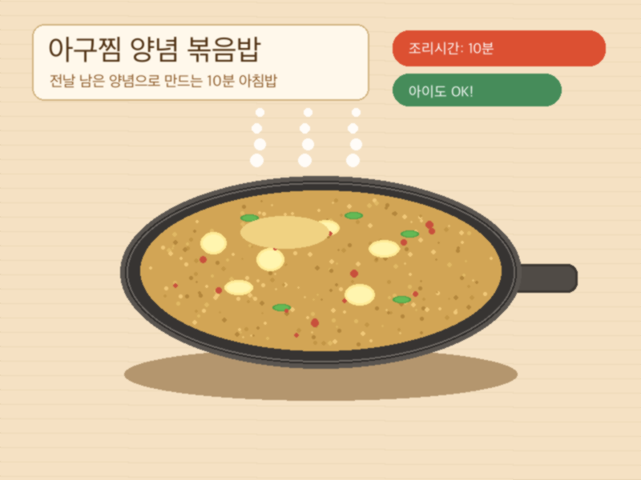

# 아구찜 양념 볶음밥

> ⏱️ 조리시간: 10분 | 🍽️ 1~2인분 | 난이도: ⭐ 쉬움

전날 남은 아구찜 양념/국물을 버리지 않고 그대로 활용하는 알뜰 아침 볶음밥이에요.
순한 맛이라 아이들과 함께 먹기에도 딱 좋아요!

## 📝 재료

### 기본 재료
- 찬밥 — 1~2공기 (200~400g)
- 달걀 — 2개
- 대파 — 1/4대 (없으면 생략 가능)
- 식용유 — 1큰술

### 추가 재료
- 김치 — 3~4큰술 (잘게 썰어서, 신김치가 더 맛있어요)
- 김가루 — 넉넉히
- 햄 또는 어묵 — 조금 (잘게 썰어서, 없으면 생략)

### 아구찜 남은 양념 (베이스)
- 아구찜 남은 양념/국물 — 3~4큰술

> 양념 구성 참고: 간장 2큰술, 설탕 1큰술, 다진 마늘 1큰술, 고춧가루 1/2작은술, 참기름 1작은술, 물 3큰술

## 👨‍🍳 만드는 법

1. **달걀을 먼저 스크램블합니다.**
   프라이팬에 식용유를 두르고 중불로 달구세요. 달걀 2개를 깨 넣고 70~80% 정도만 익혀서 한쪽으로 밀어둡니다.

2. **김치와 대파를 볶습니다.**
   달걀을 밀어둔 자리에 김치와 대파를 넣고 김치의 수분이 날아갈 때까지 1~2분 볶아주세요. 김치를 먼저 볶아야 신맛이 날아가고 감칠맛이 올라와요.

3. **찬밥을 넣고 함께 볶습니다.**
   찬밥을 넣고 주걱으로 꾹꾹 눌러가며 밥알이 떨어지도록 볶아주세요. 중강불로 올려 1~2분간 볶습니다.

4. **아구찜 남은 양념을 넣습니다.**
   밥 전체에 아구찜 남은 양념/국물을 3~4큰술 고루 뿌려주세요. 양념이 밥에 스며들도록 1~2분간 더 볶습니다.
   > 양념이 묽다면 물기가 날아갈 때까지 센 불로 30초 정도 마무리 볶음을 해주세요.

5. **김가루로 마무리합니다.**
   그릇에 담고 김가루를 넉넉히 뿌려주세요. 참기름은 남은 양념에 이미 들어있지만 한 바퀴 더 둘러도 고소해요!

## 💡 꿀팁

- **찬밥이 더 잘 볶아져요.** 갓 지은 밥은 수분이 많아 뭉칩니다. 냉장고에서 꺼낸 찬밥 그대로 사용하면 볶음밥이 훨씬 고슬고슬해져요.
- **프라이팬 하나로 끝!** 달걀, 재료, 밥을 한 팬에서 모두 조리하므로 설거지가 최소화됩니다.
- **양념이 너무 짜다면** 밥 양을 늘리거나 물을 1큰술 추가해서 농도를 조절하세요.
- **양념이 부족하다면** 간장 1작은술과 참기름 1/2작은술을 추가하면 비슷한 맛이 납니다.
- **아이 것과 어른 것을 따로 만든다면** 어른 볶음밥에만 고추장 1/2작은술을 추가하면 매콤한 맛으로 업그레이드돼요.
- **김가루는 아끼지 마세요.** 김가루가 아구찜 양념의 감칠맛과 만나면 정말 맛있어요. 비벼먹듯 넉넉히 뿌리세요.
