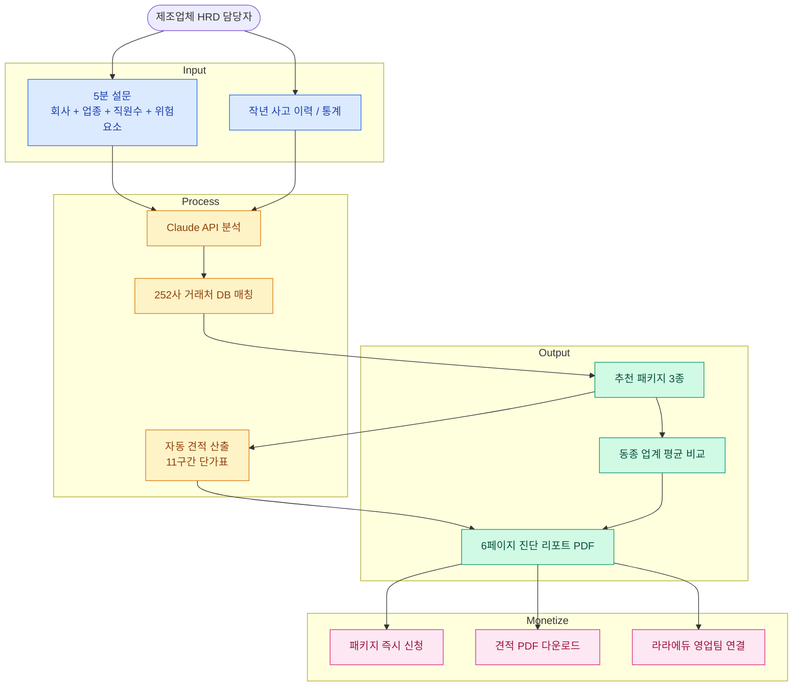
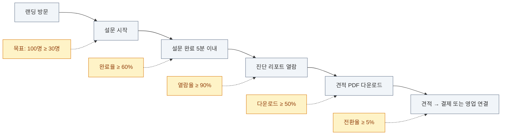

# ENTERPRISE-TARGETING — 기업 차원 교육 니즈 발견 전략

> 1명(김지원 PM)이 외부 회사에 자료 보내는 1:1 방식 대신, **외부 기업이 직접 자가 진단으로 필요 교육을 발견**하는 self-serve B2B 모델.
> 라라에듀 252사 거래처 + 견적 자동발송 시스템 + 산업안전·법정의무·요즘리더 AI 콘텐츠 자산을 직접 활용.

---

## 1. 왜 "기업 차원" 타겟팅인가 — 전략 전환의 근거

### 1.1 현재 모델의 한계

기존 MISSION.md는 "라라에듀 PM이 효율적으로 일한다"가 목표. 하지만 외부 고객(페르소나 B 박정욱) 입장에서는:

- "라라에듀가 보내준 자료가 우리 공장이랑 안 맞아요" → **사후** 발견. 이미 PM이 시간 들여 만든 후.
- "올해 우리 회사에 뭐가 필수 교육인지 모르겠어요" → 컴플라이언스 사각지대.
- "교육 예산이 한정인데 우선순위를 어떻게 정하죠?" → 의사결정 기준 없음.

PM이 외부 회사를 위해 분석하는 것보다, **외부 회사가 자기 정보를 입력해 진단받는 것**이 6배 빠르고 정확하다 (회사 내부자가 가장 잘 안다).

### 1.2 라라에듀가 이미 가진 자산 (Unfair Advantage 강화)

| 자산 | 자가 진단 도구에서 어떻게 쓰이나 |
|------|------------------------------|
| 252사 거래처 CRM | 동종 업계 회사 추천 알고리즘의 학습 데이터 |
| 견적 자동발송 시스템 | 진단 → 패키지 견적 자동 산출로 직결 |
| 산업안전 11구간 단가표 | 직원 수 입력만 받으면 정확한 단가 노출 |
| 법정의무교육 20% 동시할인 로직 | 진단 결과 묶음 추천에 즉시 반영 |
| 산업안전·법정의무·요즘리더 AI 자산 | AI 추천 후 즉시 미리보기 콘텐츠로 연결 |
| ReportLab 6페이지 PDF 자동 | 진단 리포트 자동 생성에 그대로 재활용 |

→ **새로 만들 것보다 기존 자산을 노출하는 표면적이 부족했을 뿐**. 진단 도구 = 라라에듀 자산의 자연스러운 entry point.

### 1.3 개인 사용자 → 기업 사용자 전환의 의미

| 축 | 1명(김지원 PM) | 1기업(외부 HRD 담당자) |
|----|---------------|---------------------|
| 입력 데이터 | 한 회사 정보 1번 | 회사 정보 + 사고 이력 + 인원 변동 (지속) |
| 결제 모델 | 도구 SaaS (PM당 월 5만원) | 진단 무료 → 콘텐츠 패키지 결제 (₩300만~3000만) |
| 리텐션 동인 | 시간 절감 | 컴플라이언스 갱신 주기 (분기/연) |
| 영업 사이클 | 즉시 (PM 권한) | 1-3개월 (HRD 팀장 → 임원 결재) |
| 평균 객단가 | ₩5만/월 | ₩300만~3000만/년 |

**전략적 시사점**: 기업 타겟팅이 라라에듀의 본업과 정확히 맞물림. 도구 SaaS는 부산물, 본업은 콘텐츠 매출.

---

## 2. 5가지 타겟팅 메커니즘 비교

각 메커니즘을 **데이터 입력 → 처리 → 출력** 관점에서 분해.

### A. 회사 진단 위저드 (Company Audit Wizard) ⭐ 추천

**컨셉**: 5분 설문 → AI가 회사 컴플라이언스 + 교육 갭 진단 → 추천 패키지 + 견적

```
[입력] 회사명, 업종, 직원 수, 사업장 지역, 위험 요소(체크리스트), 작년 사고 이력, 보유 자격증, 작년 교육 이수 현황
   ↓
[처리] AI가 동종 업계 252사 데이터와 매칭 → 부족 영역 우선순위 산정
   ↓
[출력] (1) 6페이지 진단 리포트 PDF (2) 추천 교육 패키지 3종 (3) 자동 견적 (4) 같은 업종 회사 평균 비교
```

| 항목 | 평가 |
|------|------|
| 라라에듀 자산 활용도 | ★★★★★ (252사 + 단가표 + ReportLab + 콘텐츠 자산 모두 사용) |
| 데이터 수집 부담 | 낮음 (HRD 담당자 5분 입력) |
| MVP 가능 범위 | 7주차에 가능 — paid_content `/audit` 라우트로 추가 |
| 결제 전환 가능성 | 높음 — 진단 마지막에 견적 노출 + "이 패키지 바로 신청" CTA |
| 리스크 | 진단 정확도가 낮으면 "AI 점쟁이" 인상. → 252사 실제 데이터로 검증 필요 |

### B. 법정의무 컴플라이언스 캘린더

**컨셉**: 회사 정보 입력 → 올해 법정의무교육 캘린더 자동 생성 → 마감 임박 시 알림

```
[입력] 회사명, 업종(KSIC 코드), 직원 수, 작년 이수 기록
   ↓
[처리] 고용노동부·산업안전보건공단 의무교육 연간 일정 매핑 → 미이수 / 갱신 필요 항목 추출
   ↓
[출력] (1) 12개월 캘린더 (2) 마감 임박 항목 알림 (3) 라라에듀 콘텐츠 즉시 신청 버튼
```

| 항목 | 평가 |
|------|------|
| 라라에듀 자산 활용도 | ★★★★ (법정의무교육 콘텐츠 + 20% 할인 로직 사용) |
| 데이터 수집 부담 | 매우 낮음 (회사 정보만) |
| MVP 가능 범위 | 8주차 + (법정 일정 데이터 정리에 시간) |
| 결제 전환 가능성 | 매우 높음 — "마감 임박" 강제 동기 |
| 리스크 | 법령 개정 시 즉시 반영 필요. 데이터 유지비용 (분기 1회 갱신) |

### C. 산업별 표준 커리큘럼 엔진

**컨셉**: 업종 + 회사 규모 입력 → 그 업종의 표준 교육 커리큘럼 출력

```
[입력] 업종(KSIC 5자리), 직원 수, 사업장 위치, 회사 형태(원청/하청/도급)
   ↓
[처리] 업종별 표준 커리큘럼 DB (자체 구축, NCS 기반) 매칭 → 회사 규모에 맞는 시간/단가 조정
   ↓
[출력] (1) 12개월 표준 커리큘럼 (2) 차시별 라라에듀 콘텐츠 매핑 (3) 견적
```

| 항목 | 평가 |
|------|------|
| 라라에듀 자산 활용도 | ★★★ (콘텐츠 자산은 활용하지만, NCS 매핑 데이터 추가 구축 필요) |
| 데이터 수집 부담 | 매우 낮음 |
| MVP 가능 범위 | Phase 2 (NCS 기반 데이터 정리에 1개월+) |
| 결제 전환 가능성 | 중간 — 표준이라 차별화 약함 |
| 리스크 | "표준" 강조하면 "왜 우리만의 게 아닌가" 반발 가능 |

### D. 사고 이력 기반 안전교육 추천

**컨셉**: 회사 안전사고 이력(자체 또는 동종 업계) → 가장 시급한 안전교육 우선순위 추천

```
[입력] 작년 사고 보고서 또는 동종 업계 사고 통계 (산업안전보건공단 공개 데이터)
   ↓
[처리] AI가 사고 유형 분석 → 같은 사고 예방하는 교육 콘텐츠 매핑 (라라에듀 자산)
   ↓
[출력] (1) "당신 회사가 가장 시급한 안전교육 3개" 리포트 (2) 사고 사례 학습 콘텐츠 (3) 견적
```

| 항목 | 평가 |
|------|------|
| 라라에듀 자산 활용도 | ★★★★★ (산업안전 콘텐츠 + 사고 사례 학습 자산 모두) |
| 데이터 수집 부담 | 중간 (사고 보고서 업로드 또는 자기보고) |
| MVP 가능 범위 | 7주차 후반 ~ 8주차 |
| 결제 전환 가능성 | 매우 높음 — "재발 방지" 강제 동기 |
| 리스크 | 사고 데이터 민감 → 비공개 처리 + 동종 업계 통계로 fallback |

### E. 임직원 설문 → AI 큐레이션

**컨셉**: HRD 담당자가 직원 10명에게 설문 링크 발송 → AI가 응답 분석 → 회사 교육 갭 진단

```
[입력] 직원 10-50명 익명 설문 응답 (직무·연차·필요 교육·작년 만족도)
   ↓
[처리] AI가 응답 클러스터링 → 회사 전체 갭 도출
   ↓
[출력] (1) 회사 교육 진단 리포트 (2) 직무별 추천 콘텐츠 (3) 견적
```

| 항목 | 평가 |
|------|------|
| 라라에듀 자산 활용도 | ★★★ |
| 데이터 수집 부담 | 매우 높음 (직원 10명 모집 + 응답 받기) |
| MVP 가능 범위 | Phase 2 (응답 수집 인프라 + 직원 동기 부여 필요) |
| 결제 전환 가능성 | 중간 — 진단까지 시간 길어서 동기 약화 |
| 리스크 | 직원 응답률 낮으면 진단 의미 없음 |

---

## 3. 추천 — A (회사 진단 위저드) + D (사고 이력 기반) 조합

### 3.1 조합 근거

| 차원 | 단독 A | 단독 D | A + D 조합 |
|------|:-----:|:-----:|:---------:|
| 라라에듀 자산 활용도 | ★★★★★ | ★★★★★ | ★★★★★ |
| 결제 전환 동기 | 높음 (예방) | 매우 높음 (재발방지) | 매우 높음 |
| MVP 가능성 | 7주차 | 7주차 후반 | 7주차 + 8주차 |
| 차별화 강도 | 중간 (다른 LMS도 진단 있음) | 매우 높음 (한국 제조업 특화) | 매우 높음 |
| 영업 시나리오 | "올해 필수" | "재발 방지" | "예방 + 재발 방지" 풀세트 |

→ **A는 모든 회사가 진입할 수 있는 광범위 입구, D는 특정 업종(제조업)에 강한 락인**.

### 3.2 차별화 메시지

| 경쟁 | 그들이 못 하는 것 | 우리만 가능 |
|------|----------------|------------|
| Docebo / Sana | 한국 법정의무교육 자동 매핑 X | A의 3.b 출력 |
| 휴넷 | 회사별 진단 → 콘텐츠 추천 X (표준 콘텐츠만) | A의 3.c + D 전체 |
| ChatGPT 무료 진단 | 252사 비교 데이터 X, 견적 자동 산출 X | A의 3.d (동종 업계 평균) + 견적 |
| 컨설팅 회사 (PWC 등) | 1건당 수천만원 + 2-3개월 | 5분 진단 + 즉시 견적 (10초) |

---

## 4. MVP 통합 안 — 7주차 후반에 추가

### 4.1 라우트 설계 (paid_content 확장)

```
paid_content/
├── app/
│   ├── audit/                       # 신규 — 회사 진단 위저드
│   │   ├── page.tsx                 # 5분 설문 폼
│   │   ├── [auditId]/
│   │   │   └── page.tsx             # 진단 결과 + 패키지 추천
│   │   └── api/
│   │       └── analyze/route.ts     # AI 분석 + 견적 산출
│   ├── incident/                    # 신규 — 사고 이력 기반 추천
│   │   ├── page.tsx
│   │   └── [incidentId]/page.tsx
│   └── (existing routes)
```

### 4.2 데이터 모델

```sql
-- 진단 세션 (입력 + 결과 + 결제 전환 트래킹)
create table public.audits (
  id              bigint primary key generated by default as identity,
  user_id         uuid references auth.users(id),
  company_name    text not null,
  industry_code   text,                     -- KSIC 5자리
  employee_count  int  not null,
  region          text,
  risk_factors    text[],                   -- ["고소작업","화학물질","용접",...]
  last_year_incidents int default 0,
  last_year_training  jsonb,                -- 작년 이수 현황
  ai_diagnosis    text,                     -- AI가 생성한 진단 본문
  recommended_packages jsonb,               -- 추천 패키지 3개 (시간/단가 포함)
  estimated_total int,                      -- 자동 견적 합계
  similar_companies_avg jsonb,              -- 동종 업계 평균 비교
  status          text default 'completed', -- in_progress / completed / converted
  converted_to_quote_at timestamptz,        -- 견적 전환 시각
  paid_at         timestamptz,              -- 실제 결제 전환 시각
  created_at      timestamptz default now()
);

create index audits_industry_idx on public.audits(industry_code);
create index audits_user_id_idx on public.audits(user_id);
```

### 4.3 데이터 흐름



### 4.4 7주차 ~ 8주차 일정 추가

| 일자 | 기존 작업 | 추가 작업 |
|------|----------|----------|
| Day 1-2 | Setup + Auth | (변경 없음) |
| Day 3 | 고객사 폼/목록 | (변경 없음) |
| Day 4-5 | Claude API + 스트리밍 | **+ /audit 폼 페이지** |
| Day 6 | 채팅 이력 + 재방문 | **+ 진단 분석 API + 견적 산출 로직** |
| Day 7 | MD 다운로드 + 배포 | **+ 진단 리포트 PDF (ReportLab 재활용)** |
| 8주차 Day 1-2 | 김지원 실사용 1라운드 | **+ 거래처 5사 진단 위저드 시범 사용** |
| 8주차 Day 3-4 | 데모 시나리오 | **시나리오를 "진단 → 견적 → 결제" 풀스택으로** |

→ 7주차 일정에 약 4-6시간 추가. 데모 임팩트는 2배 이상.

---

## 5. 측정 지표 — Funnel + Cohort

### 5.1 진단 위저드 Funnel (KPI)



### 5.2 Cohort 분석

- 1차 코호트: 라라에듀 거래처 5사 (Stage 2 베타)
- 2차 코호트: HRD 카페 게시 후 신규 진입자 50명
- 비교: 거래처가 자가 진단해서 견적 요청한 시간 vs 김지원 PM이 만들어 보내는 시간

### 5.3 실패 신호

- 설문 시작 후 30% 이상이 3분 안에 이탈 → 입력 부담 과다 → 항목 줄이기
- 진단 정확도 응답 < 4/5 (NPS) → 252사 데이터 매핑 정확도 부족 → 데이터 정제
- 진단만 받고 결제 0건 → "AI 점쟁이" 인상 → 견적 노출 시점 조정 (진단 직후 → 며칠 후 이메일)

---

## 6. AUDIENCES.md 업데이트 제안

이 문서가 적용되면 페르소나 B(박정욱)의 위치가 변경됨:

| 변경 전 | 변경 후 |
|---------|---------|
| **B는 이 도구를 직접 쓰지 않음** | **B가 자가 진단 위저드의 1번 사용자** |
| 김지원 PM이 결과물 만들어 B에게 보냄 | B가 자기 회사 진단 → 라라에듀 콘텐츠 발견 → 결제 |
| 8주차 발표는 김지원 워크플로우 | 8주차 발표는 김지원 (내부) + 박정욱 (외부) 듀얼 시나리오 |

→ AUDIENCES.md §1.B 페르소나 설명에 "★ 진단 위저드 1번 외부 사용자" 추가 권장.

---

## 7. 위험 요소 + 완화

| 위험 | 가능성 | 완화 |
|------|:-----:|------|
| 진단 정확도가 낮아 "AI 점쟁이" 인상 | 중 | 7주차 시작 전 라라에듀 거래처 5사 데이터로 진단 정확도 검증 (블라인드 테스트) |
| HRD 담당자가 직접 사용하지 않음 (페르소나 B Tech 친숙도 낮음) | 중 | 김지원 PM이 1회 동행 시연 → 이후 자체 사용. 진입은 PM 보조, 정착은 HRD 직접 |
| 252사 데이터 동의 이슈 | 낮음 | 진단에는 통계만 사용 (개별 회사 노출 X), 별도 데이터 사용 동의 추가 |
| Claude API 비용 (5분 설문 분석 비용) | 낮음 | claude-haiku-4-5로 제한, 1회 ₩50~200 추정. 진단 무료라 견적 전환만 되면 ROI ✓ |
| 견적 자동 산출 정확도 | 낮음 | 기존 견적 자동발송 시스템과 동일 단가표 재사용 — 신규 위험 0 |

---

## 8. 다음 액션 (이 문서 작성 직후)

- [ ] MISSION.md §3 해결 방법에 "기업 자가 진단" 추가 — "PM 도구 + 기업 진단 듀얼"
- [ ] DEV.md §1 MVP 범위에 `/audit` 라우트 YES 추가
- [ ] DEV.md §3 데이터 모델에 `audits` 테이블 추가
- [ ] AUDIENCES.md §1 페르소나 B 위치 업데이트
- [ ] MINIMAP.md §3 Architecture에 audit 흐름 추가
- [ ] 7주차 시작 전 — 라라에듀 거래처 5사 데이터로 진단 정확도 사전 검증
- [ ] paid_content `/audit` 신규 라우트 구현 (현재 시점 — 완료 시 즉시 추가)

---

> **핵심 한 줄**: 라라에듀의 252사 거래처 데이터 + 11구간 단가표 + 콘텐츠 자산을 외부 회사가 5분 안에 만질 수 있는 표면으로 노출하는 것.
> 새 자산을 만드는 게 아니라, **기존 자산의 entry point**를 만드는 일.
