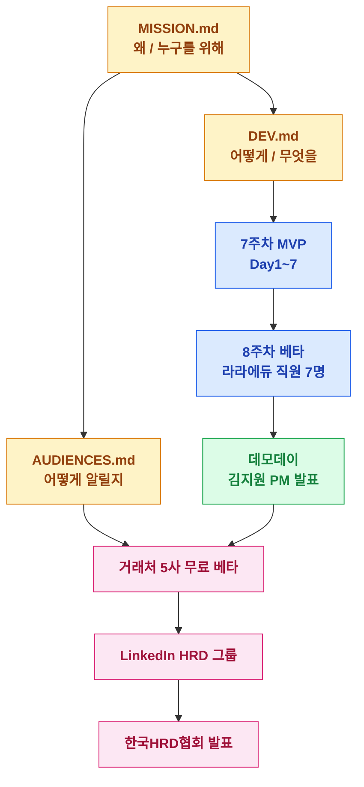
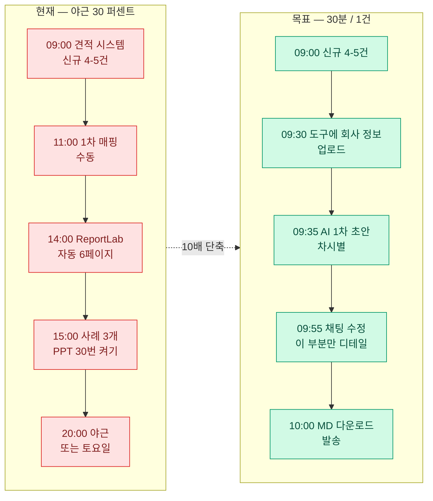
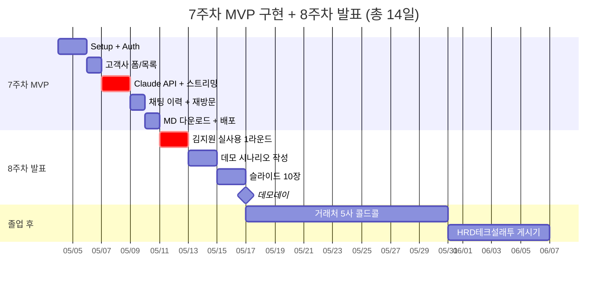
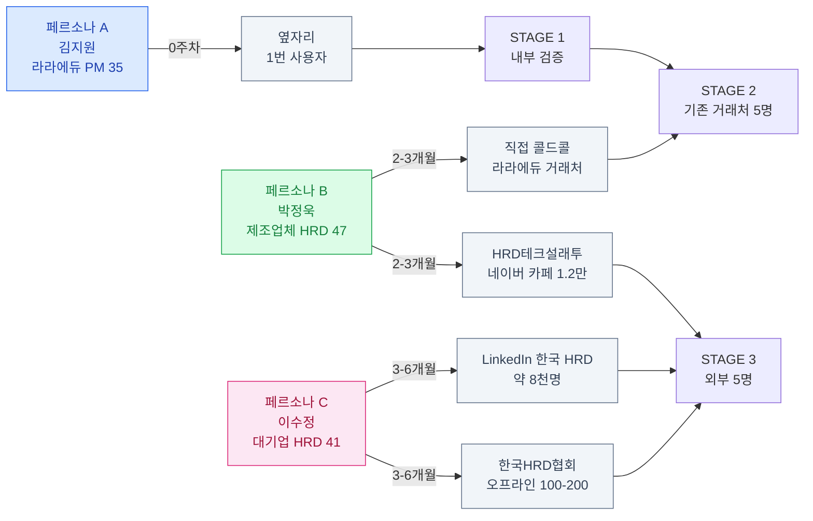
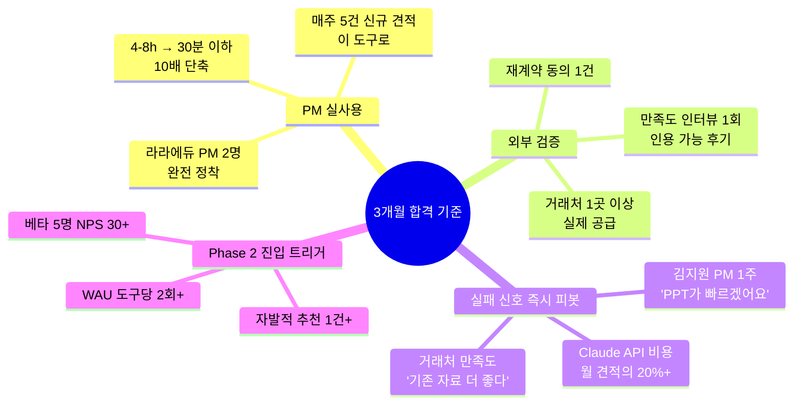
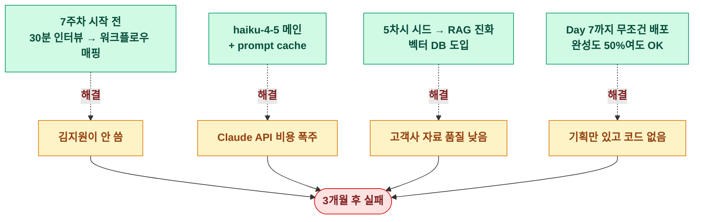
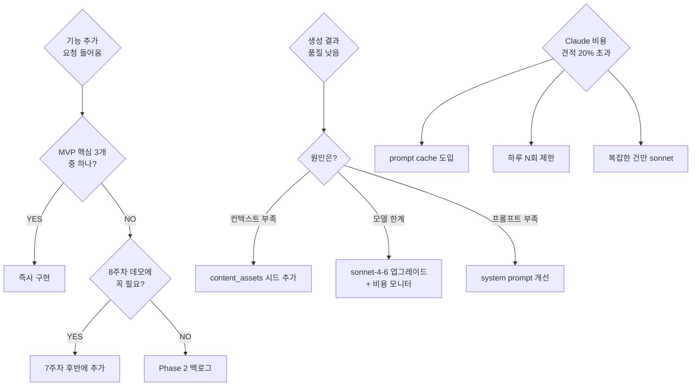

# 🗺 PROJECT MINIMAP — 라라에듀 AI 콘텐츠 빌더 한눈에 보기

> MISSION / DEV / AUDIENCES 3종 문서를 7개 다이어그램으로 시각화. GitHub에서 자동 렌더링됨.
> 막히거나 PR 리뷰할 때 "왜 만들지?" "어디까지 했지?" 답하는 사령탑.

---

## 1. 📦 Plan Hub — 전체 문서 구조 + 흐름

기획서 3종이 어떻게 7주차 MVP → 8주차 데모데이 → Phase 2 SaaS로 이어지는가.



---

## 2. 🔄 김지원 PM의 하루 — Before vs After

도구가 PM 한 명의 워크플로우를 어떻게 바꾸는지 가시화. **이 변화가 안 일어나면 도구는 실패**.



---

## 3. 🏗 MVP Architecture — 7주차에 만드는 것

데이터 흐름 + 외부 의존. 박스 하나가 빠지면 MVP 안 돌아감.

```mermaid
flowchart TB
    classDef ui fill:#e0e7ff,stroke:#4f46e5,color:#3730a3
    classDef api fill:#fef3c7,stroke:#d97706,color:#92400e
    classDef db fill:#fce7f3,stroke:#db2777,color:#9f1239
    classDef ext fill:#f3e8ff,stroke:#9333ea,color:#6b21a8

    PM([라라에듀 PM])

    subgraph Frontend [Next.js App Router on Vercel]
        UI1[고객사 등록 폼]:::ui
        UI2[채팅 인터페이스]:::ui
        UI3[고객사별 이력]:::ui
        UI4[MD 다운로드 버튼]:::ui
    end

    subgraph Backend [Server Components + Route Handlers]
        Auth[Supabase Auth<br/>이메일+비밀번호]:::api
        StreamAPI[Vercel AI SDK<br/>토큰 스트리밍]:::api
    end

    subgraph DB [(Supabase Postgres)]
        T1[client_companies<br/>252사]:::db
        T2[content_assets<br/>라라에듀 5차시 시드]:::db
        T3[generation_sessions]:::db
        T4[session_messages<br/>user/assistant]:::db
    end

    Claude[Claude API<br/>haiku-4-5 / sonnet-4-6]:::ext
    Storage[Supabase Storage<br/>로고 업로드 - Phase2]:::ext

    PM --> UI1 --> Auth
    UI1 --> T1
    UI2 --> StreamAPI --> Claude
    Claude -.system prompt.-> T2
    StreamAPI --> T4
    UI3 --> T3
    T3 --> T4
    T4 --> UI4
```

---

## 4. 📅 7주차 ~ 데모데이 Gantt



---

## 5. 👥 페르소나 × 채널 매핑

누구를 어디서 만날지. **A는 옆자리, C는 LinkedIn에서 — 메시지는 다르게**.



---

## 6. 🎯 경쟁사 포지셔닝 — 우리가 노릴 빈 자리

```mermaid
quadrantChart
    title 경쟁사 vs 라라에듀 빌더 — 가격대 × 한국 제조업 특화도
    x-axis 글로벌 표준 --> 한국 제조업 특화
    y-axis 저가 (PM 1명 월 5만원) --> 고가 (연 3천만+)
    quadrant-1 고가 + 특화 (희소)
    quadrant-2 고가 + 글로벌 (Docebo Sana 영역)
    quadrant-3 저가 + 글로벌 (없음 — 가능성)
    quadrant-4 저가 + 특화 (블루오션 ★)
    Docebo: [0.2, 0.85]
    Sana Labs: [0.15, 0.8]
    휴넷: [0.7, 0.55]
    "라라에듀 빌더 (target)": [0.95, 0.2]
```

> **블루오션 가설**: 한국 제조업 직무 교육 콘텐츠 자동 맞춤화 + PM 1명 월 5만원 가격대.
> Docebo·Sana는 글로벌·고가, 휴넷은 콘텐츠 표준화 → **빈 사분면 4번**.

---

## 7. 🧠 Definition of Success — 합격 / 실패 신호

3개월 시점 기준. 이 기준 안 맞으면 즉시 피봇.



---

## 8. ⚠️ Pre-mortem — "실패한다면 왜?"

DEV.md §5 위험 요소를 인과 그래프로.



---

## 9. 🔁 결정 트리 — 막혔을 때 펼쳐볼 의사결정

핵심 결정 5개를 의사결정 흐름으로.



---

## 📍 Quick Index

| 섹션 | 무엇을 보여주나 | 언제 펼쳐 보나 |
|------|----------------|---------------|
| 1. Plan Hub | 3종 문서 → MVP → 데모 → Phase 2 | 신규 합류자에게 5분 브리핑 |
| 2. Before/After | 김지원 PM의 하루 변화 | 영업 / 발표 슬라이드 만들 때 |
| 3. MVP Architecture | 7주차에 만들 시스템 | 코딩 시작 전 / PR 리뷰 |
| 4. Gantt | 14일 일정 | 매일 아침 진척 점검 |
| 5. 페르소나 × 채널 | 누구에게 어떻게 알릴지 | AUDIENCES.md 액션 짤 때 |
| 6. 경쟁사 포지셔닝 | 우리가 노릴 빈 자리 | 가격 / 메시지 결정할 때 |
| 7. Success / 실패 신호 | 3개월 기준 | 매주 회고 |
| 8. Pre-mortem | 실패하면 왜? + 해결책 | 위험 신호 보일 때 |
| 9. 결정 트리 | 막혔을 때 의사결정 | 새 요청·이슈 들어올 때 |

---

> **이 미니맵의 메타 규칙**:
> - 다이어그램이 텍스트 문서를 대체하지 않음 — 네비게이션이지 본문 아님
> - 코드 / 일정이 변하면 이 파일도 같이 변경 (분기당 1회 점검)
> - 새 다이어그램 추가는 환영, 단 본문 9개 → 12개 넘으면 분리 검토
